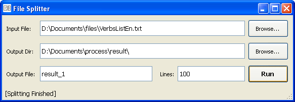

# File Splitter

Splits text files to smaller ones using the lines count parameter.
Developed using Qt4.

## Features

- allows to set select an input file, output directory and output filename pattern
- allows to set lines count which indicate the maximum lines number the the resulting subfiles will contain
- requires input text files to be UTF-8 encoded and creates correct UTF-8 encoded output

## Shortcuts

- **F2** - Browse for output directory
- **F3** - Browse for input file
- **F5** - Run the splitting
- **Esc** - Exit
